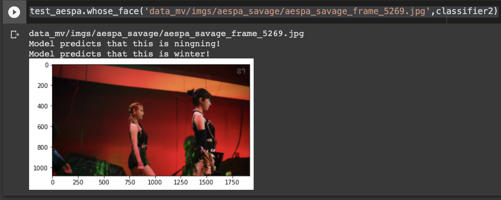

# aespa_faces

This is a face recognition program for K-POP group named Aespa.

Main file is aespa_facerecognition.py which also could be run on google colab (see. Run on google colab)

get_video.py is the file for extracting image from MV video

--------------------------------------------

# Run on google colab

1. Create a folder and Upload data file into your Google Drive

2. Run this scipt before this program

    from google.colab import drive

    drive.mount('/content/gdrive')

    import os

    os.chdir('gdrive/MyDrive/[Your folder name]')

    !pip install mtcnn

    !pip install keras-facenet

--------------------------------------------

# Data

Train and Validation data are .npz files

Or you can download raw files from 

https://drive.google.com/drive/folders/1KVAuNYk3OHEvHlKNmMeV1dyMvOZXN8vg?usp=sharing

# Example

